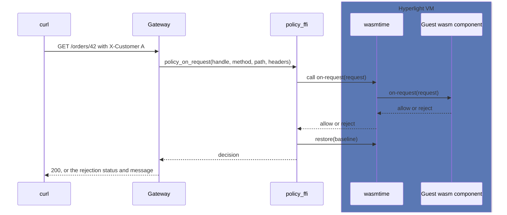

# Hyperlight API Management demo

Run untrusted customer code as WebAssembly components inside Hyperlight
micro-VMs, driven by a C# gateway.

Each customer ships a Wasm component that decides what to do with a request. The gateway loads one
component per customer and calls it on every request. The component
returns `allow` or `reject`. Every component runs in its own VM. The VM
resets to a clean baseline after each call.

## Prerequisites

Install these first:

* [Rust](https://rustup.rs) and [just](https://github.com/casey/just):
  `cargo install just`.
* The build tools:
  ```bash
  cargo install wasm-tools wasmtime-cli cargo-component
  cargo install componentize-qjs-cli --locked
  cargo install hyperlight-wasm-aot --version 0.14.0 --locked
  ```
* The [.NET SDK](https://dotnet.microsoft.com/download).
* A supported hypervisor:
  * Linux: [KVM](https://help.ubuntu.com/community/KVM/Installation) or
    Microsoft Hypervisor (MSHV). You need read/write access to `/dev/kvm`
    or `/dev/mshv`.
  * Windows: [Windows Hypervisor Platform](https://docs.microsoft.com/en-us/virtualization/api/#windows-hypervisor-platform)
    (WHP).

  See Hyperlight's [getting started guide](https://github.com/hyperlight-dev/hyperlight/blob/main/docs/getting-started.md)
  for setup details.

Rust 1.94 and the `wasm32-unknown-unknown` target are pinned in
`rust-toolchain.toml`. rustup installs them on the first build.

Run `just setup` to check every tool and print an install command for any
that are missing.

## Run the demo

From the repo root, in order:

```bash
just setup      # 1. check prerequisites
just build      # 2. build contract, guests, cdylib, and gateway
just run        # 3. start the gateway on localhost:5000 (keep running)
```

Then in a second terminal:

```bash
just demo       # 4. curl session that exercises customers A and B
```

## Repository

* `wit/policy.wit` — the interface every customer must implement, written
  in WIT (WebAssembly Interface Types). It is like a language-neutral
  interface or header. It names one function, `on-request`, with its
  input and output types. A customer writes code that implements it. The
  gateway calls it.
* `guests/` — example implementations of the WIT above, each compiled to
  a Wasm component. `auth_check` (Rust), `path_block` (JavaScript).
* `policy_ffi/` — a small C API wrapping hyperlight-wasm.
* `dotnet/PolicyEngine/` — C# P/Invoke wrapper over that C ABI.
* `dotnet/Gateway/` — a small HTTP server that routes requests using
  `X-Customer`.
* `justfile` — build, run, and demo recipes.
* `demo.sh` — the curl session that `just demo` runs.

## How it works

### What WIT is for

WIT (WebAssembly Interface Types) is a language-neutral way to describe an
interface, like a header file or a C# interface. `wit/policy.wit` names
one function, `on-request(request) -> decision`, and the types that cross
the host/guest boundary.

The customer implements this interface in any language that compiles to a
Wasm component. The gateway calls it. Both sides generate their
marshalling code from the same `.wit` file, so no one hand-writes it and
the two sides cannot disagree on the types.

### Exports and imports

A WIT world has two sides, read from the guest's point of view:

* Exports are what the customer's component provides. The `policy` world
  exports the `handler` interface, so the customer implements
  `on-request`. This is their policy code.
* Imports are what the service provides to the component. The `policy`
  world imports the `types` interface. It holds only type definitions
  (`request`, `decision`, `header`, `rejection`), no functions, so the
  customer gets no host calls in this demo. A richer version would import
  host functions here, for example logging or a secrets lookup, that the
  customer could call.

So the customer implements the exports. The service provides the imports.

### Per request

1. The gateway reads `X-Customer` and picks that customer's loaded
   sandbox handle.
2. It marshals method, path, and headers across the C ABI into
   `policy_ffi`.
3. `policy_ffi` calls the guest export. The core call is
   `MultiUseSandbox::call`, which runs `on-request` inside the VM.
4. The guest returns `allow` or `reject`.
5. `policy_ffi` restores the sandbox to its load-time snapshot with
   `MultiUseSandbox::restore`, wiping per-request state.
6. The gateway maps the decision to an HTTP response.

### Diagram



